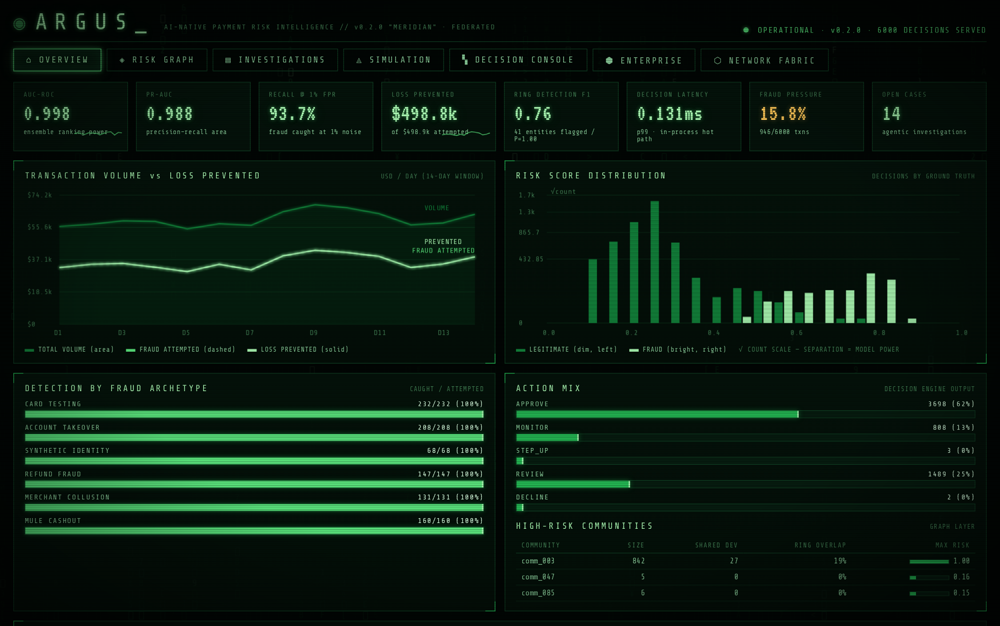
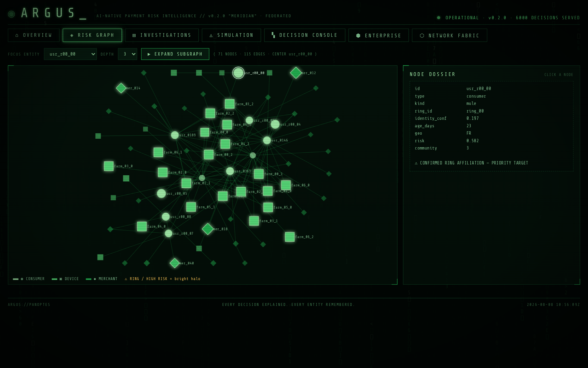
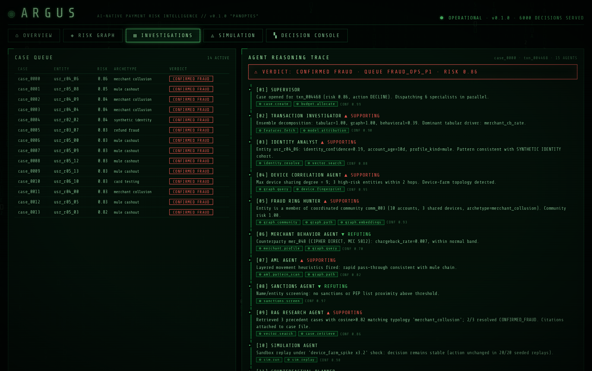
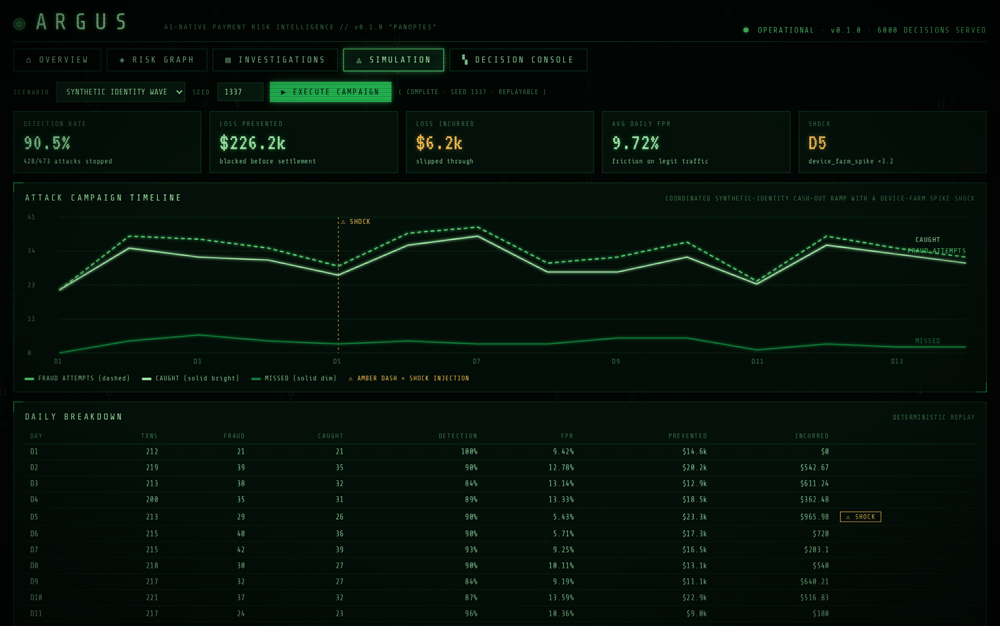
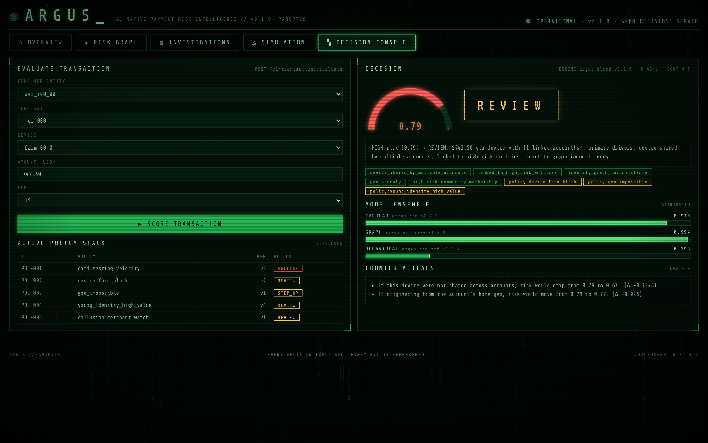
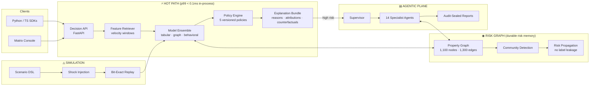
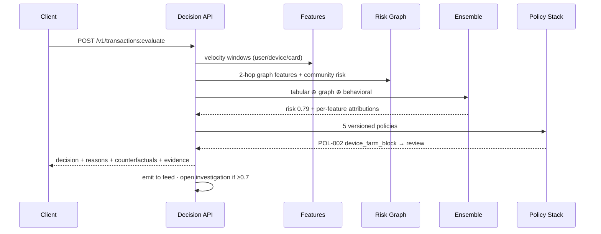
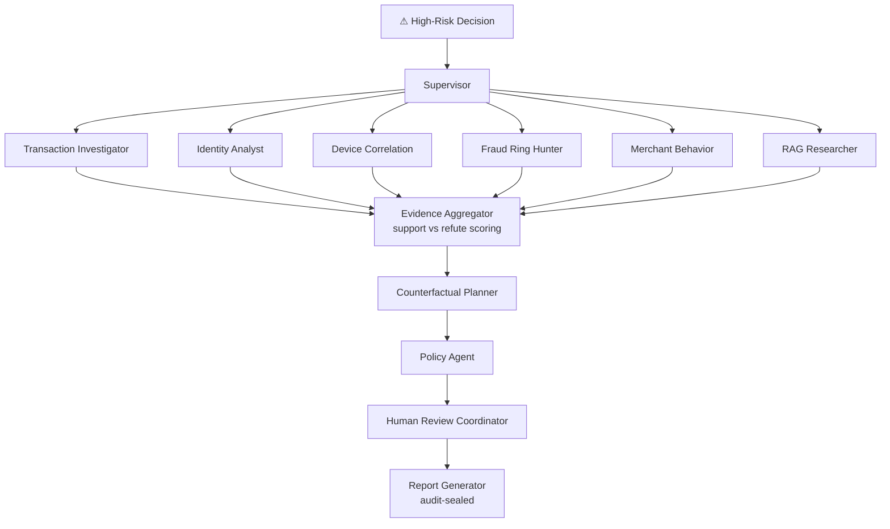

<div align="center">

```
 ░█████╗░░██████╗░░░██████╗░░██╗░░░██╗░░██████╗
 ██╔══██╗░██╔══██╗░██╔════╝░░██║░░░██║░██╔════╝
 ███████║░██████╔╝░██║░░██╗░░██║░░░██║░╚█████╗░
 ██╔══██║░██╔══██╗░██║░░╚██╗░██║░░░██║░░╚═══██╗
 ██║░░██║░██║░░██║░╚██████╔╝░╚██████╔╝░██████╔╝
 ╚═╝░░╚═╝░╚═╝░░╚═╝░░╚═════╝░░░╚═════╝░░╚═════╝░
        ◉  T H E   A L L - S E E I N G   R I S K   G R A P H  ◉
```

### **AI-Native Payment Risk Intelligence Platform**

*Fraud is not a sequence of bad transactions. Fraud is a networked adversarial system.*

**ARGUS is the immune system for digital payments** — a living risk graph, an ensemble decision
engine, a 15-agent investigation crew, and a deterministic attack simulator, wrapped in a
monochrome phosphor console straight out of the Matrix.

[](docs/metrics/metrics.json)
[](#)
[](tests/)
[](#-benchmark-report-card)
[](#-benchmark-report-card)
[](#-benchmark-report-card)
[](#-deterministic-by-construction)
[](LICENSE)

**Tool tags:**


</div>

---

## ◉ The Console

Every pixel of the ARGUS console is a monochrome green **luminance ramp** on CRT black —
identity is carried by direct labels, shapes and dash patterns (never hue alone), and the
amber/red status accents are reserved exclusively for `⚠ SHOCK` and `CONFIRMED FRAUD`.

### ⌂ Overview — the risk operations picture
KPI tiles with live sparklines, transaction volume vs. loss prevented, the risk-score
separation histogram (√-scale), per-archetype detection, action mix, high-risk communities
and the live decision feed.



### ◈ Risk Graph — the fraud ring, made visible
Force-directed subgraph explorer over the entity graph. `◉ consumers`, `▣ devices`,
`◆ merchants`; bright halo = ring/high-risk. Click any node for its dossier — here the
platform has locked onto `usr_r00_00`, a 23-day-old mule wired into a device farm.



### ▤ Investigations — 15 agents, every step tool-tagged
Each case carries the full agent reasoning trace: supervisor dispatch, specialist findings
(`▲ SUPPORTING` / `▼ REFUTING`), per-step **tool tags** (`⚙ graph.community`,
`⚙ vector.search`, `⚙ sim.replay` …), confidence, hypothesis scoring and the sealed
audit report.



### ◬ Simulation — attack campaigns with shock injection
Deterministic adversarial campaigns: synthetic-identity waves, card-testing storms, mule
cash-outs — with mid-campaign shocks (`⚠ device_farm_spike ×3.2`), adaptive-adversary
evasion, and per-day economics. Same seed → bit-identical replay.



### ▚ Decision Console — one transaction, fully explained
Score any transaction against the live graph: gauge, action badge, reason-code chips,
policy hits, per-model attributions, and counterfactuals
(*"if this device were not shared, risk drops 0.79 → 0.67"*).



---

## ▦ Benchmark Report Card

All numbers are produced by [`argus/evaluate.py`](backend/argus/evaluate.py) on the seeded
synthetic world (`seed=1337`: 487 consumers, 60 merchants, 605 devices, **7 fraud rings**,
6,000 transactions, 15.8% fraud pressure) and written to
[`docs/metrics/metrics.json`](docs/metrics/metrics.json).
**This is a synthetic benchmark** — it measures the engine's mechanics, not production claims.

### Model scores

| Metric | Score | Reading |
|---|---:|---|
| **AUC-ROC** | **0.9979** | ranking power of the 3-model ensemble |
| **PR-AUC** | **0.9882** | precision–recall area under heavy class imbalance |
| **Recall @ 1% FPR** | **93.7%** | fraud caught while annoying ≤1% of legit users |
| **Recall @ 5% FPR** | **100%** | |
| Precision @ action | 0.635 | of `review`/`decline` decisions, share that were fraud |
| Recall @ action | 1.000 | fraud that reached `review`/`decline` |
| F1 @ action | 0.776 | |
| Calibration ECE | 0.241 | honest gap — scores are discriminative, not yet calibrated |

### Graph layer — fraud-ring detection *(no label leakage: topology only)*

| Metric | Value |
|---|---:|
| Ring members in world | 67 |
| Entities flagged by risk propagation | 41 |
| **Precision** | **1.000** |
| **Recall** | **0.612** |
| **F1** | **0.759** |

### Decision latency (in-process hot path)

| p50 | p90 | p99 | mean |
|---:|---:|---:|---:|
| 0.050 ms | 0.066 ms | **0.098 ms** | 0.049 ms |

### Confusion matrix @ action threshold

|  | Flagged | Passed |
|---|---:|---:|
| **Fraud** | 946 (TP) | 0 (FN) |
| **Legit** | 545 (FP) | 4,509 (TN) |

### Detection by archetype · Action mix

| Archetype | Caught / Attempts | | Action | Count | Share |
|---|---:|---|---|---:|---:|
| card_testing | 232 / 232 | | approve | 3,698 | 61.6% |
| account_takeover | 208 / 208 | | monitor | 808 | 13.5% |
| mule_cashout | 160 / 160 | | step_up | 3 | 0.1% |
| refund_fraud | 147 / 147 | | review | 1,489 | 24.8% |
| merchant_collusion | 131 / 131 | | decline | 2 | 0.0% |
| synthetic_identity | 68 / 68 | | | | |

### Simulation campaigns (seed 1337, adaptive adversary)

| Scenario | Detection | Prevented | Incurred | Avg daily FPR |
|---|---:|---:|---:|---:|
| synthetic_identity_wave | 90.5% | $226.2k | $6.2k | 9.72% |
| mule_cashout_campaign | 87.9% | $207.2k | $6.4k | 6.84% |

### Agentic investigations

12 cases auto-opened on the highest-risk decisions → **11 confirmed_fraud, 1 cleared**,
15 agents dispatched per case, every trace step tool-tagged and audit-sealed.

---

## ◈ Architecture



### Decision flow



### Agent collaboration



---

## ▤ The Agent Roster

Every trace step records the exact platform tools invoked — the `⚙ tool tags` you see in
the console.

| # | Agent | Mission | Tool tags |
|--:|---|---|---|
| 01 | **Supervisor** | routes the case, allocates budgets | `case.create` `budget.allocate` |
| 02 | **Transaction Investigator** | decomposes the triggering decision | `features.fetch` `model.attribution` |
| 03 | **Identity Analyst** | synthetic-identity & consistency checks | `identity.resolve` `vector.search` |
| 04 | **Device Correlation** | farm topology, reuse, evasion | `graph.query` `device.fingerprint` |
| 05 | **Fraud Ring Hunter** | coordinated community search | `graph.community` `graph.path` `graph.embeddings` |
| 06 | **Merchant Behavior** | collusion & chargeback anomalies | `merchant.profile` `graph.query` |
| 07 | **AML Agent** | structuring / layering / mule chains | `aml.pattern_scan` `graph.path` |
| 08 | **Sanctions Agent** | sanctions / PEP screening | `sanctions.screen` |
| 09 | **RAG Researcher** | precedent cases with citations | `vector.search` `case.retrieve` |
| 10 | **Simulation Agent** | stress-tests the hypothesis | `sim.run` `sim.replay` |
| 11 | **Counterfactual Planner** | what-if action outcomes | `decision.replay` `model.counterfactual` |
| 12 | **Evidence Aggregator** | support-vs-refute hypothesis scoring | `evidence.merge` `hypothesis.score` |
| 13 | **Policy Agent** | recommends policy adjustments | `policy.eval` `policy.diff` |
| 14 | **Human Review Coordinator** | queue routing + SLA tracking | `queue.route` `sla.track` |
| 15 | **Report Generator** | investigator-ready sealed report | `report.render` `audit.bind` |

---

## ▚ The Policy Stack

| ID | Policy | Ver | Trigger | Action |
|---|---|---:|---|---|
| POL-001 | `card_testing_velocity` | v3 | ≥5 txns/hr under $5 | **DECLINE** |
| POL-002 | `device_farm_block` | v2 | device shared by ≥5 accounts | REVIEW |
| POL-003 | `geo_impossible` | v1 | cross-geo and > $500 | STEP_UP |
| POL-004 | `young_identity_high_value` | v4 | identity conf < 0.5 and > $250 | REVIEW |
| POL-005 | `collusion_merchant_watch` | v1 | merchant on watchlist | REVIEW |

---

## ⚡ Quickstart

Zero external services — the graph, vector, and stream layers run in-process.

```bash
pip install -r requirements.txt

# boot the platform (seeds the world, streams 6,000 txns through the engine)
uvicorn backend.api.main:app --port 8000
# → open http://localhost:8000  — welcome to the construct

# run the report card
cd backend && python -m argus.evaluate   # writes docs/metrics/metrics.json

# run the test suite
python -m pytest tests/ -q               # 22 passed

# or docker
docker compose -f infra/docker/docker-compose.yml up
```

### Score a transaction

```bash
curl -X POST localhost:8000/v1/transactions:evaluate \
  -H 'Content-Type: application/json' \
  -d '{"consumer_id":"usr_r00_00","merchant_id":"mer_031",
       "device_id":"farm_00_0","amount":742.50,"geo":"US"}'
```

```jsonc
{
  "decision": "review",
  "risk_score": 0.79,
  "action_reasons": ["device_shared_by_multiple_accounts",
                     "linked_to_high_risk_entities", "policy:device_farm_block"],
  "graph_evidence": { "entity_id": "usr_r00_00", "community_id": "comm_003",
                      "device_sharing_max": 11, "linked_high_risk_entities": 9 },
  "counterfactuals": [{ "intervention": "device_not_shared",
                        "narrative": "If this device were not shared across accounts, risk would drop from 0.79 to 0.67." }],
  "explanation": "HIGH risk (0.79) → REVIEW. $742.50 via device with 11 linked account(s)..."
}
```

### SDKs

```python
from argus_sdk import ArgusClient                       # sdk/python

client = ArgusClient(base_url="http://localhost:8000")
d = client.evaluate(consumer_id="usr_r00_00", merchant_id="mer_031",
                    device_id="farm_00_0", amount=520.0)
print(d["risk_score"], d["decision"])                   # 0.79 review
```

```ts
import { ArgusClient } from "@argus/sdk";               // sdk/typescript

const client = new ArgusClient({ baseUrl: "http://localhost:8000" });
const d = await client.evaluate({ consumer_id: "usr_r00_00",
  merchant_id: "mer_031", device_id: "farm_00_0", amount: 520 });
console.log(d.risk_score, d.decision);
```

---

## ▦ API Surface

| Method | Endpoint | Purpose |
|---|---|---|
| POST | `/v1/transactions:evaluate` | real-time risk decision with full explanation bundle |
| GET | `/v1/transactions/{id}/decision` | stored decision (deterministic replay source) |
| GET | `/v1/entities/{id}/graph` | depth-limited entity subgraph |
| POST | `/v1/graph/path` | shortest path between entities |
| GET | `/v1/graph/communities` | detected communities ranked by risk |
| POST | `/v1/investigations` | dispatch the 15-agent crew on a decision |
| GET | `/api/cases` · `/api/cases/{id}` | case queue · full trace + sealed report |
| GET | `/v1/simulations` | scenario catalog |
| POST | `/v1/simulations/{name}:run?seed=…` | run a deterministic attack campaign |
| GET | `/api/metrics` | full benchmark report card |
| GET | `/api/overview` · `/api/feed` · `/api/policies` · `/api/agents` | console data plane |

---

## ◬ Deterministic by Construction

Reproducibility is a first-class requirement for regulated environments:

- **One seed builds the world.** `World(seed=1337)` → identical consumers, rings, device
  farms, and the exact same 6,000-transaction stream, every time.
- **Decisions replay bit-exactly.** Same world + same transaction → same score, same
  reasons, same counterfactuals (asserted in [`tests/test_engine.py`](tests/test_engine.py)).
- **Simulations replay bit-exactly.** Stochastic outcomes (step-up bypass, downstream
  catches, adversary evasion) are derived from `CRC32(txn_id, seed)` — process-stable,
  no salted `hash()`, no wall clocks.
- **No label leakage.** Graph risk propagation never reads `ring_id`; ring detection
  precision 1.0 comes from shared-device topology alone (tested).

---

## ◉ Design System — "Phosphor"

The console follows a strict monochrome discipline (validated with a palette checker:
adjacent-step CVD ΔE 15, contrast ≥ 3:1 against the CRT surface):

| Rule | Implementation |
|---|---|
| Magnitude | single green **luminance ramp** `#a8f5b0 → #58e07a → #23b552 → #12813a` |
| Identity | direct labels + dash patterns + node shapes (`◉ ▣ ◆`) — never hue alone |
| Status | amber `⚠ SHOCK` / red `CONFIRMED FRAUD` — reserved, always icon + label |
| One axis per chart | volume/prevented share $/day; histogram is √-count and says so |
| Hover layer | crosshair + tooltips on every chart, per-mark tooltips on bars/nodes |
| Text | ink tokens only (`#d8ffe0`/`#86c896`/`#3f7a50`); series color never colors text |

Plus: matrix rain at 16% opacity, CRT scanlines + vignette, `Share Tech Mono` / `VT323`,
corner-notched panels, and phosphor glow on everything that matters.

---

## ▤ Repository Structure

```text
argus/
├── backend/
│   ├── api/main.py            # FastAPI service — decision/graph/agent/sim planes + console
│   └── argus/
│       ├── synth.py           # seeded synthetic payment world (rings, farms, mules)
│       ├── graph.py           # property graph, communities, leak-free risk propagation
│       ├── engine.py          # 3-model ensemble, policy stack, counterfactuals
│       ├── agents.py          # 15-agent orchestrator with tool-tagged traces
│       ├── simulation.py      # attack campaigns, shock injection, exact replay
│       └── evaluate.py        # offline report card → docs/metrics/metrics.json
├── frontend/                  # Matrix console (vanilla JS + hand-rolled canvas charts)
├── simulation/scenarios/      # scenario DSL (YAML)
├── sdk/python/ · sdk/typescript/
├── infra/docker/              # Dockerfile, compose, screenshot harness
├── docs/screenshots/ · docs/metrics/
└── tests/                     # 22 tests: determinism, policies, graph, API contracts
```

---

## ◈ Production Topology

The reference implementation keeps identical interfaces to the production drop-ins:

| In-process layer | Production drop-in |
|---|---|
| Property graph (`graph.py`) | **Neo4j** + GDS (Louvain, embeddings) |
| Decision feed list | **Kafka** topics (`argus.txn.*`, `argus.alerts`, `argus.audit`) |
| Velocity windows (`VelocityTracker`) | **Redis** sliding-window counters |
| Precedent retrieval (RAG agent) | **Qdrant** hybrid dense+filtered search |
| Heuristic ensemble | **XGBoost + GraphSAGE + sequence transformer** via model registry |
| Case store | **PostgreSQL** (tenants, cases, policies, immutable audit) |

---

## ◬ Roadmap

- [x] **Phase 0–1** — decision API, entity graph, policy engine, case queue *(this repo)*
- [x] **Phase 2** — community detection, ring discovery, graph explorer *(this repo)*
- [x] **Phase 3** — 15-agent investigation suite with reasoning traces *(this repo)*
- [x] **Phase 4** — simulation platform with shock injection + exact replay *(this repo)*
- [ ] **Phase 5** — multi-tenant enterprise plane (SSO/SCIM, RBAC/ABAC, residency)
- [ ] **Phase 6** — cross-network privacy-preserving shared risk graph

---

<div align="center">

**EVERY DECISION EXPLAINED. EVERY ENTITY REMEMBERED.**

`ARGUS://PANOPTES` — *the hundred-eyed watchman never sleeps.*

</div>
